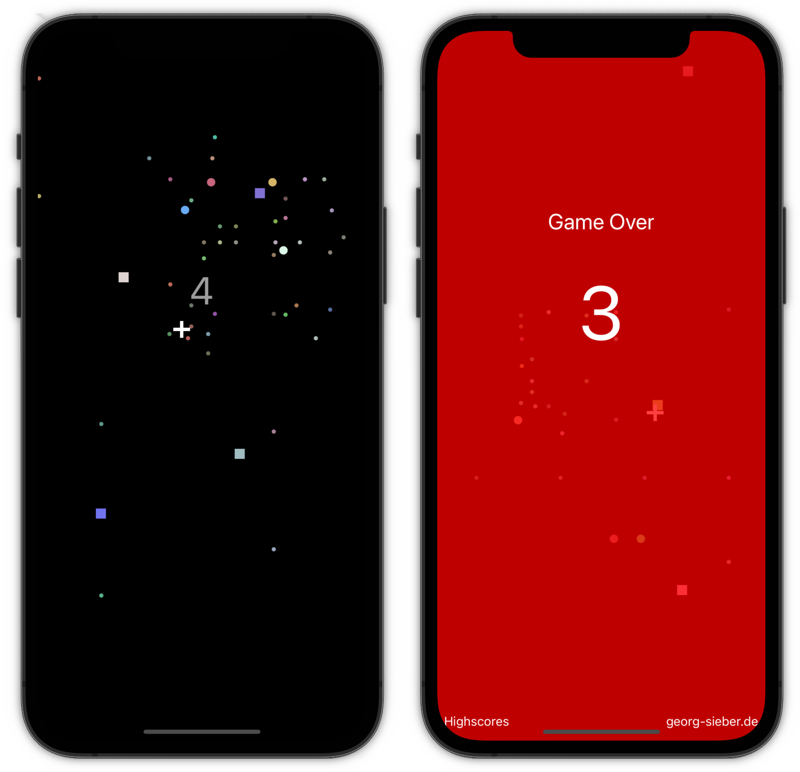

# BallBreak-iOS

The goal of the mini-game BallBreak is to make the balls -which follow your finger- bounce off the squares. Do not touch a ball or a square with your finger.  

It is also available for [Android](https://github.com/schorschii/BallBreak-Android).

## Screenshots

